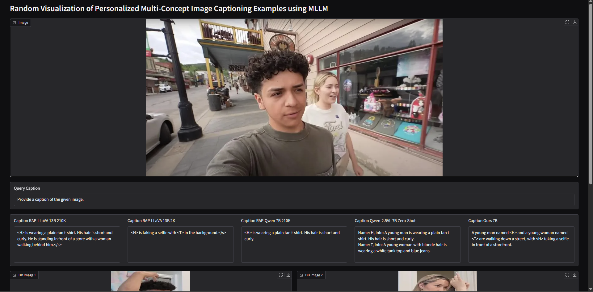

# [NeurIPS 2025] RePIC: Reinforced Post-Training for Personalizing Multi-Modal Language Models

[](https://arxiv.org/abs/2506.18369) [](https://huggingface.co/Yeongtak/RePIC_Qwen2.5VL_7B) [](https://huggingface.co/datasets/Yeongtak/RePIC-training-data) [](https://drive.google.com/file/d/1DKPmLI58NZUpSUFEUgzpUmMKKPK3Oguc/view?usp=sharing) [](https://drive.google.com/file/d/1d33cP7VWxS_7PWqaV7yAYgNIfMFWcrlA/view?usp=sharing) [](https://drive.google.com/file/d/1VzNLzzjqEfVcpWDT-3m6O71CAImoD8qE/view?usp=sharing) [](https://api.wandb.ai/links/oyt/z3fc7bwz)

We introduce RePIC, the first RL-based post-training framework for personalized image captioning, which leverages GRPO with three novel verifiable rewards (object consistency, visual localization, and identity consistency) to mitigate the data-centric limitations of previous SFT-based methods and achieve strong, generalizable performance in multi-concept personalization scenarios.


## 📄 Abstract

Recent multi-modal large language models (MLLMs) often struggle to generate personalized image captions, even when trained on high-quality captions. In this work, we observe that such limitations persist in existing post-training-based MLLM personalization methods. Specifically, despite being post-tuned with large-scale caption data through supervised fine-tuning (SFT), these models frequently fail to produce faithful descriptions in real-world scenarios, such as multi-concept image captioning. However, acquiring large-scale, high-quality captions for such complex settings is both costly and difficult. To address the data-centric nature of SFT, we propose a **reinforcement learning (RL)-based post-training framework**. To the best of our knowledge, this is the first RL-based approach to post-train MLLMs for personalized image captioning. Our method significantly enhances both visual recognition and personalized generation capabilities of MLLMs, and consistently outperforms existing SFT-based baselines, especially in the challenging multi-concept image captioning task.

## 🧑‍🔬 Authors & Affiliations

* **Authors**: Yeongtak Oh, Jisoo Mok, Dohyun Chung, Juhyeon Shin, Sangha Park, Johan Barthelemy, and Sungroh Yoon
* **Affiliations**: Seoul National University, NVIDIA

---

<p align="center">
  
</p>

## 📦 Installation Guide (Inference Only)

Our codebase has been tested on **CUDA 12.4**. Please follow the instructions below:

```bash
# Create and activate conda environment
conda create -n RePIC python=3.11 -y
conda activate RePIC

# Install CUDA 12.4 toolkit
conda install nvidia/label/cuda-12.4.0::cuda-toolkit

# Setup permissions and dependencies
chmod 755 *.sh
bash ./setup.sh

# Set up kernel
conda install ipykernel -y
python -m ipykernel install --user --name RePIC --display-name RePIC
```

> ⚠️ If installation fails, it may be due to issues with the `flash_attention_2` library.  
Please refer to the official [Qwen2.5-VL repository](https://github.com/QwenLM/Qwen2.5-VL) for alternative inference guidance.

We have only tested inference with the **`flash_attention_2`** setup. Logs and example outputs are included in [`inference_example.ipynb`](./inference_example.ipynb).

---

## 🧪 Inference Example

The `inference_example.ipynb` notebook contains:
- Scripts to run **inference with your own queries**
- Reproducible code for **Figure 1, Figure A.1 and Figure A.2** in our paper

---

## 📁 Used Databases

Please refer to the database located in the `data/` folder.

---

# 🏋️ Training & 📊 Evaluation

## 1. Training


First, you can download our **5K dataset** used for training here:

📎 [Google Drive Link](https://drive.google.com/file/d/1DKPmLI58NZUpSUFEUgzpUmMKKPK3Oguc/view?usp=sharing)

> ✅ Note: We only used a **2K subset** of this dataset for training purposes.

After downloading, save it to a local folder.

Next, navigate to the `./training/` directory and run `bash setup.sh` to complete the environmental setup.

```bash
conda activate RePIC
chmod 755 *.sh
bash setup.sh
```

Then, you need to modify the `path/to/your/data` in the following files:

- a) `src/open-r1-multimodal/data_config/personalize_ft.yaml`

- b) `src/open-r1-multimodal/run_scripts/RePIC_training_lora.sh`

After that, execute the following commands to start training:

```bash
cd ./src/open-r1-multimodal/run_scripts
chmod 755 *.sh
cd ../../..
bash ./src/open-r1-multimodal/run_scripts/RePIC_training_lora.sh
```

Note: We used the Qwen-2.5VL Instruct 7B model and support LoRA training.

To view the training logs for RePIC, please refer to the W&B report linked at the top of this README. Our reproduction experiments were conducted on a single node with 8 A40 GPUs.

## 2. Evaluation
In our reproduction experiments, we observed a performance drop in Recall—approximately 6% in the single-concept setting and 8% in the multi-concept setting—when using our pre-uploaded Hugging Face model in both skip-retrieval and retrieval-based evaluations. Despite our efforts, we were unable to resolve this issue. We sincerely apologize for this limitation, and we conjecture that the mismatch may arise from the process of merging the LoRA checkpoint. To address this, we provide our trained LoRA checkpoint to enable more faithful reproduction of our single- and multi-concept personalized captioning experiments. 

> Please note that we recommend using this LoRA weight only for quantitative reproduction, as most of the qualitative examples presented in our work were successfully reproduced with the Hugging Face model.

📎 [RePIC LoRA Checkpoint Link](https://drive.google.com/file/d/1d33cP7VWxS_7PWqaV7yAYgNIfMFWcrlA/view?usp=sharing)

The evaluation is a two-step process.

### 1. Generate Captions

First, download the LoRA checkpoint and place it in your local directory.

Then, modify `caption_eval_*.py` files using that directory and generate the personalized captions by executing the appropriate script:

* **For single-concept images:**
    ```bash
    chmod 755 *.sh
    bash execution_single.sh
    ```

* **For multi-concept images (For 2 and 4-concepts):**
    ```bash
    bash execution_multi.sh
    ```

To reproduce the results in the retrieval setting, please install the `faiss` library using the following command:

```bash
pip install faiss-cpu==1.10.0
pip install -r requirements.txt
```

Note that we use `faiss-cpu` to avoid potential CUDA compatibility issues.

Captions for both with and without retrieval will be saved in the `save_script/` directory.

After all captions have been generated, run the following commands to evaluate:

```bash
cd evaluation/
python eval_single_concept.py
python eval_multi_2_concept.py
python eval_multi_4_concept.py
```

These scripts output Precision, Recall, and F1-score to reproduce the results presented in our paper.

We also support preference-based evaluations using GPT-4o and Gemini used in our experiments. 

Feel free to customize the evaluation prompts on your own!

---

## 🖼️ Visualization Example

You can run the `gradio_example_2_concept.ipynb` and `gradio_example_4_concept.ipynb` notebooks for **visualization with pre-generated captions** without installing the environmental settings.

> 📌 Note: We curated the database and query images for a 4-concept setting; all evaluation images used for 2-concept settings are credited to [RAP-MLLM](https://arxiv.org/abs/2410.13360). For the query image dataset download, please refer to the `data/README.md` file.

Feel free to try it out! The example screenshots are as follows. 

> ## 2-concept personalization scenario
<p align="center">
  
</p>

> ## 4-concept personalization scenario
<p align="center">
  
</p>

---

## 🙏 Acknowledgements

We gratefully acknowledge the following open-source repositories and resources that supported our work:

- 🔗 [VLM-R1 (Om-AI-Lab)](https://github.com/om-ai-lab/VLM-R1)  
- 🔗 [Qwen2.5-VL (QwenLM)](https://github.com/QwenLM/Qwen2.5-VL)
- 🔗 [RAP-MLLM](https://github.com/Hoar012/RAP-MLLM)
